#### These procedure steps will be followed on the simulator

1. Open the centrifugal pump experiment and click on the arrow to start as shown in the circle. 
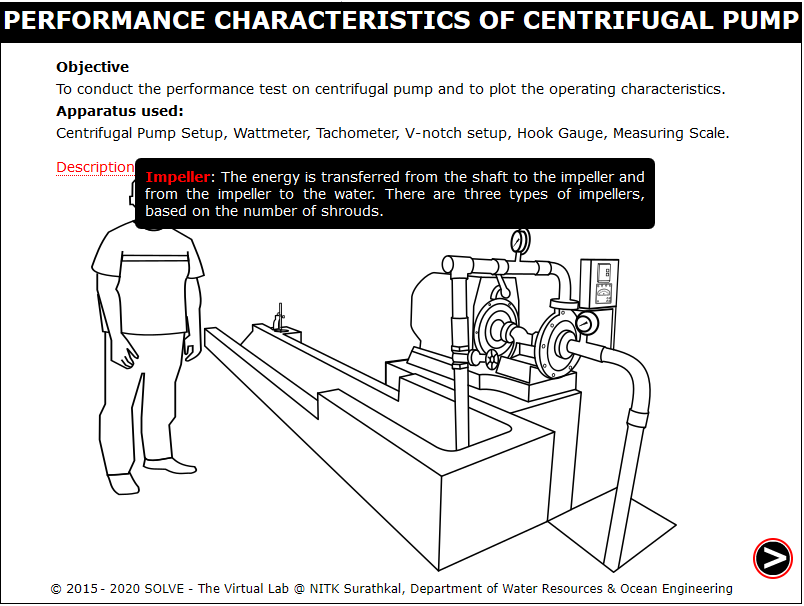 

2. Click on the green button to start the pump. 
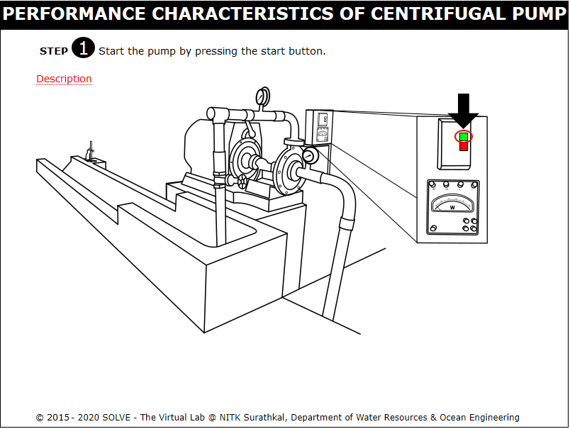 

3. Click on the arrow at the bottom of the page to proceed. 
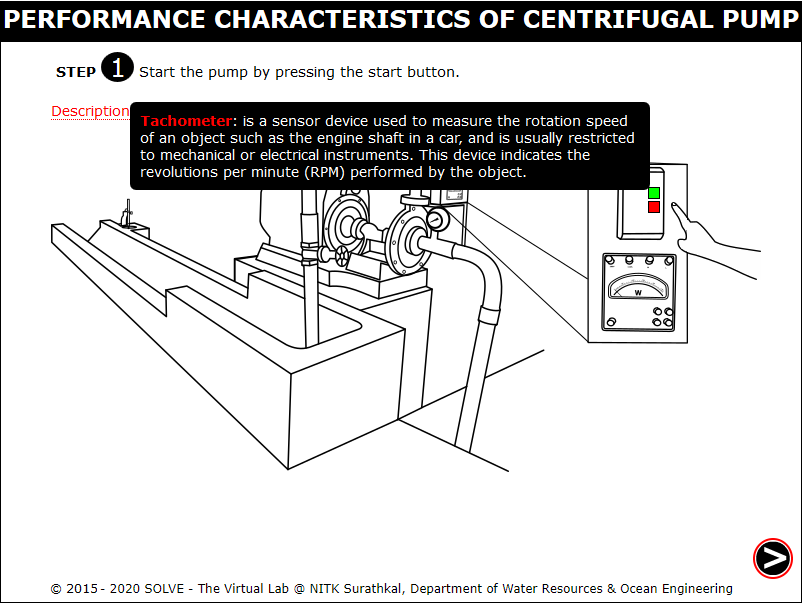 

4. Rotate the handle to set the speed of the motor as shown below. 
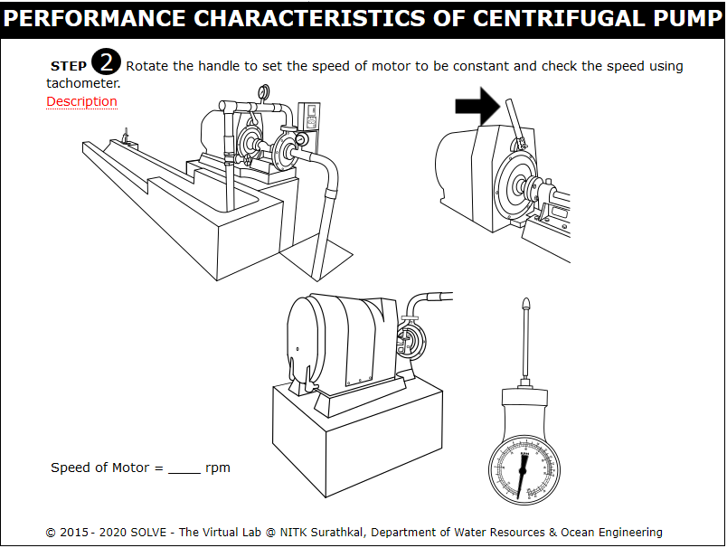 

5. Insert the tachometer into the pump to determine the speed. 
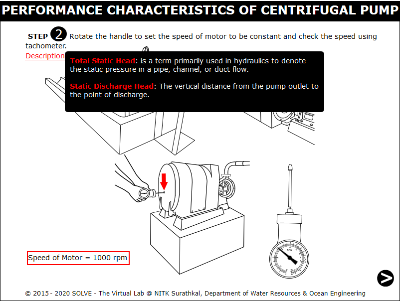 

6. Click on the arrow at the bottom of the page to proceed. 
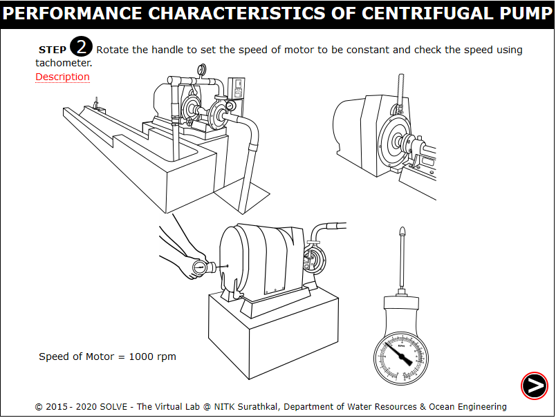 

7. Rotate the valve to fill the water in the channel till the crest level. 
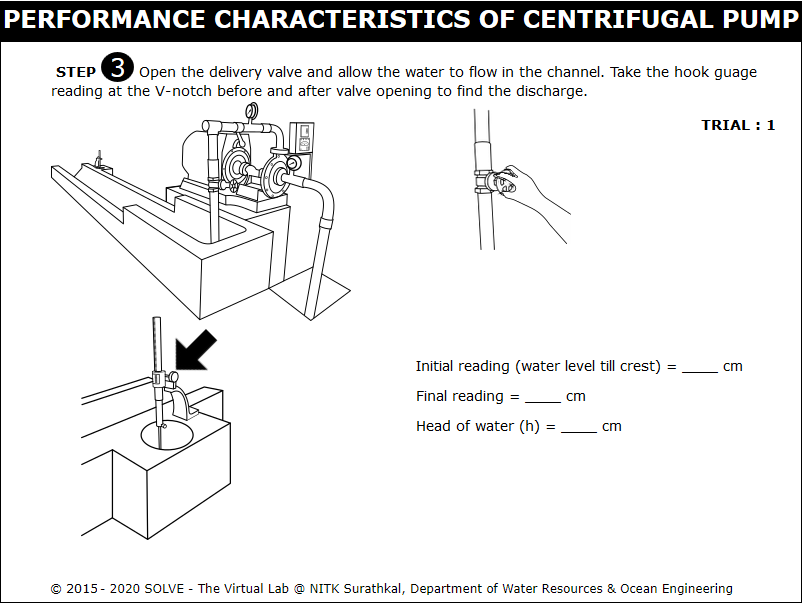 

8. Turn the knob of hook gauge to know the initial reading. 
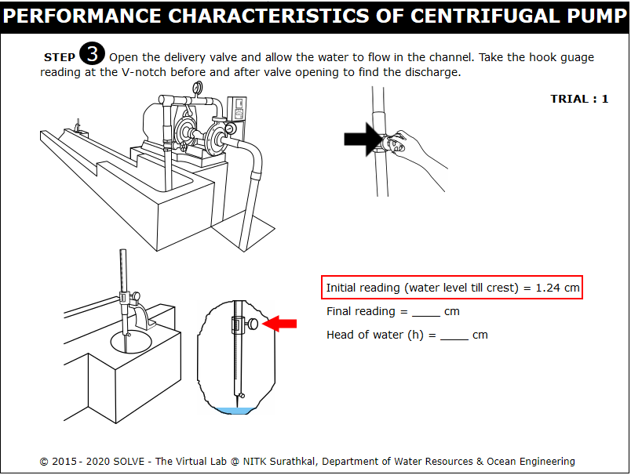 

9. Increase the flow by turning the valve. 
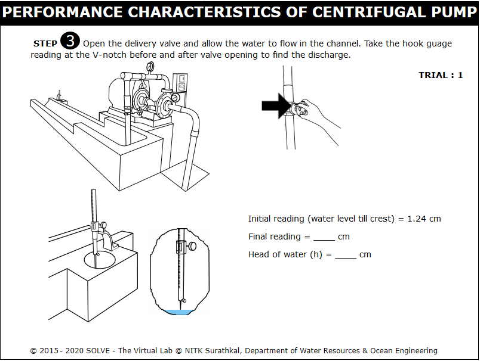 

10. Turn the knob of hook gauge to get the final reading and calculate Actual Discharge. 
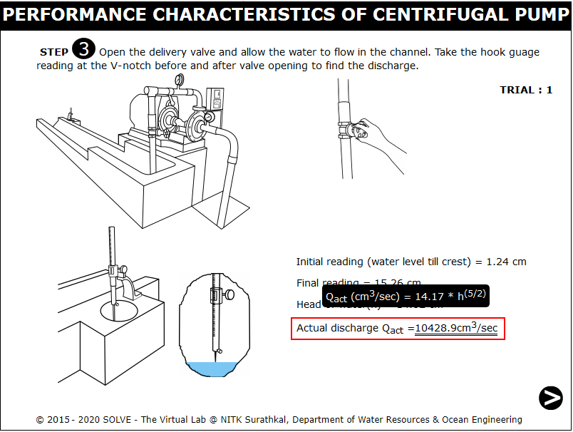 

11. Click on the arrow at the bottom of the page to proceed. 
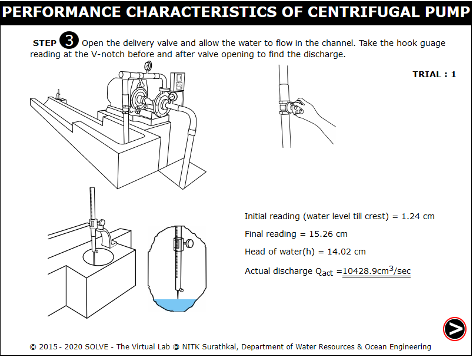 

12. Click on the delivery gauge to determine the delivery head. 
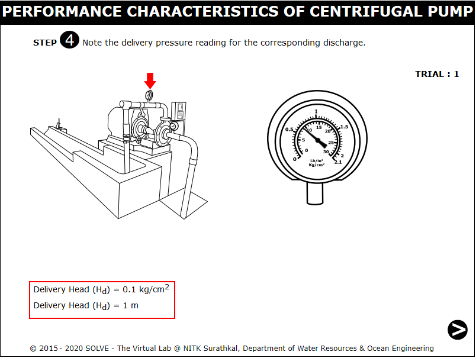 

13. Click on the arrow at the bottom of the page to proceed. 
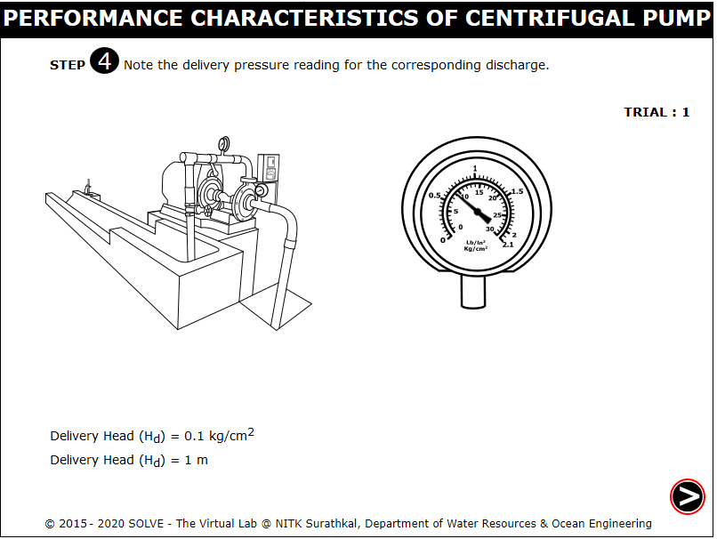 

14. Click on the suction gauge to know the suction head. 
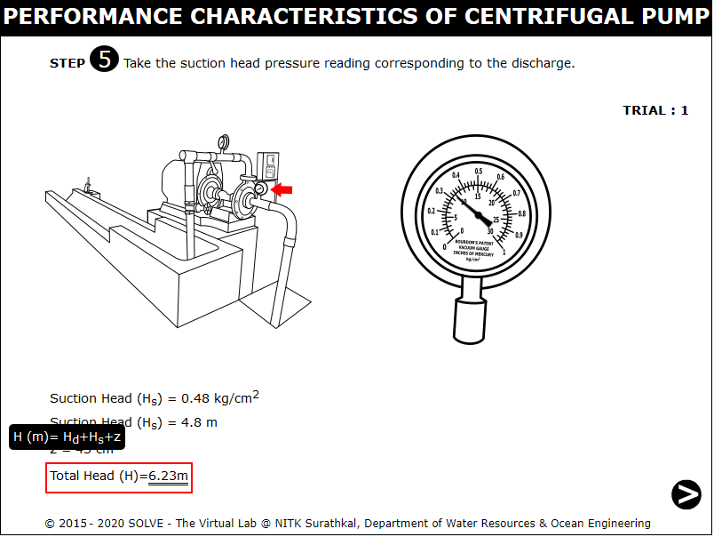 

15.  Click on the arrow at the bottom of the page to proceed. 
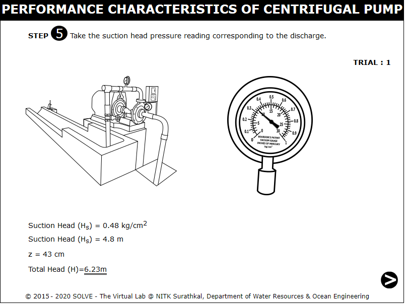 

16. Click on the wattmeter to get the wattmeter reading. 
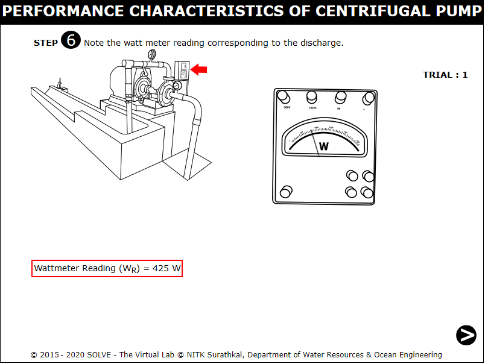 

17. Click on the arrow at the bottom of the page to proceed. 
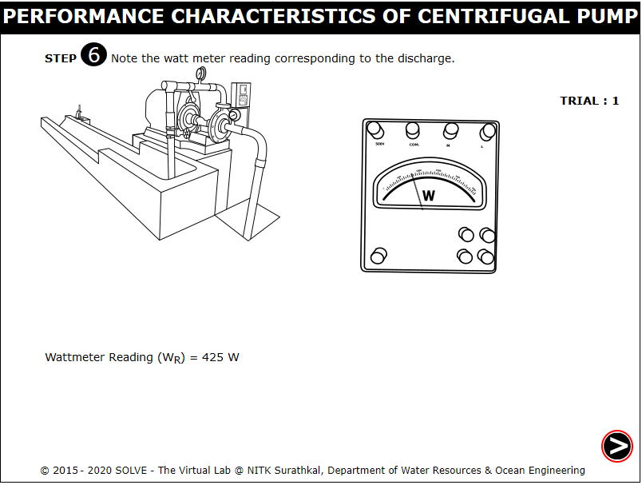 

18. Calculate the Efficiency and click NEXT to proceed. 
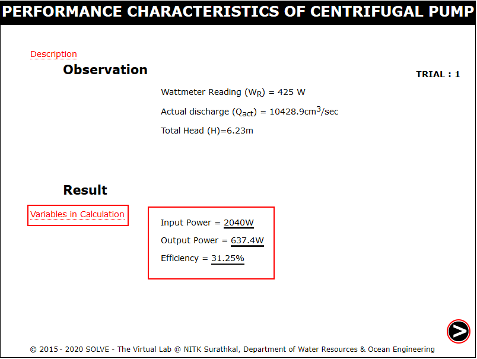 

19. Repeat the above steps for certain number of trials and click on the red button to stop the pump and click NEXT. 
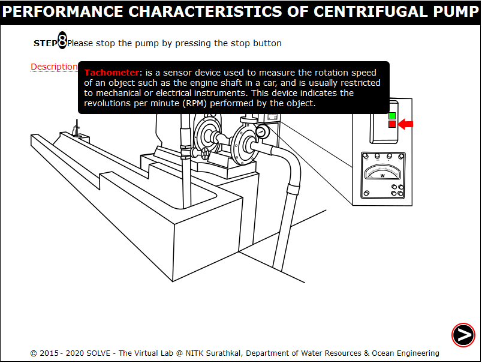 

20. Click on each label to view the plotted graph. 
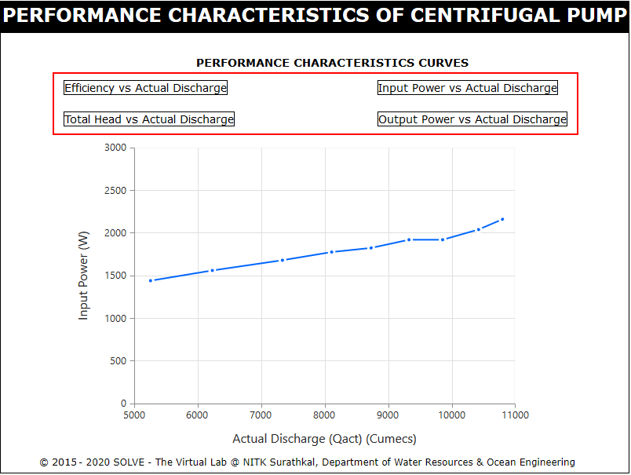 
