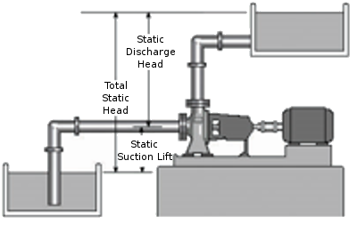
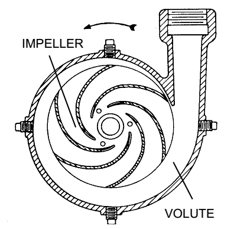
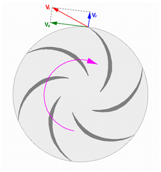
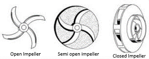
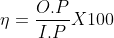

### INTRODUCTION 

Centrifugal pump is a roto-dynamic machine that imparts energy to fluid by rotating impeller to increase the pressure of a fluid. These pumps are commonly used to move liquids through a piping system. When the fluid enters the pump impeller along or near to the rotating axis it is accelerated by the impeller, flowing radially outward into a diffuser or volute chamber (casing), from where it exits into the downstream piping system. Centrifugal pumps are used for large discharge through smaller heads.

The fluid enters the inlet of the centrifugal pump under atmospheric pressure, and flows into the eye of the impeller. The Centrifugal force exerted on the liquid by the rotating impeller, moves the liquid away from the impeller eye and out along the impeller vanes to their extreme tip where the liquid is then forced against the inside walls of the volute and out through the discharge of the pump.

  

Representation of Static Discharge Head, Static Suction Lift and Total Static Head
 

Source: (<a href="https://www.pumpsandsystems.com/topics/pumps/characteristics-centrifugal-pumps-0912">https://www.pumpsandsystems.com/topics/pumps/characteristics-centrifugal-pumps-0912</a>)

 

  

 

  

Cross Section of Centrifugal pump
 

Source: A Brief Introduction to Centrifugal Pumps" by Joe Evans, Ph.D

 

<h4 style="text-indent:50px;text-align:justify"> Impeller: </h4>

The energy is transferred from the shaft to the impeller and from the impeller to the water. There are three types of impellers, based on the number of shrouds.

<ul style="text-indent:25px;text-align:justify;list-style-position: inside;">
  <li>Open Impeller: The vanes are cast free on both sides.</li>

  <li>Semi-Open Impeller: The vanes are free on one side and enclosed on the other.</li>

  <li>Closed Impeller: The vanes are located between the two discs, all in a single casting.</li>
</ul>

  

Types of Impeller

Source: (<a href="https://www.michael-smith-engineers.co.uk/resources/useful-info/centrifugal-pumps">https://www.michael-smith-engineers.co.uk/resources/useful-info/centrifugal-pumps)</a>

 

<h4 style="text-indent:50px;text-align:justify">  Volute Case: </h4>

The volute is a curve shaped region that expands in cross-sectional area as it wraps around the pump casing. The purpose of the volute is to collect the liquid discharged from the periphery of the impeller at high velocity and gradually cause a reduction in fluid velocity by increasing the flow area. This converts the velocity head to static pressure. The fluid is then discharged from the centrifugal pump through the discharge connection.

The performance characteristics of centrifugal pump can be determined by following formulae.

<ul style="text-indent:25px;text-align:justify;list-style-position: inside;">
  <li>Input power, I.P = WR x WC x ηm x Np 

  Where, WR = Watt meter reading 

  WC = Wattmeter constant 

  ηm = Efficiency of motor 

  Np = Number of phases </li>

  <li>Output power, O.P = γ x Q x H = ρ x g x Q x H 

  where, ρ = Density of the water 

  g = Acceleration due to gravity 

  Q = Discharge 

  H = Total head 

  <li>Efficiency, = 
  <!--  -->
   </li>
</ul>
